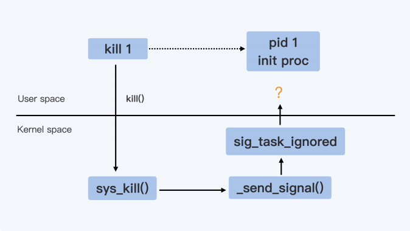
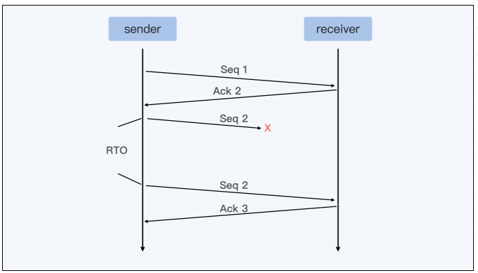

- [开篇词 | 一个态度两个步骤，成为容器实战高手](#开篇词--一个态度两个步骤成为容器实战高手)
- [01 | 认识容器：容器的基本操作和实现原理](#01--认识容器容器的基本操作和实现原理)
- [02 |理解进程（1）：为什么我在容器中不能kill 1号进程](#02-理解进程1为什么我在容器中不能kill-1号进程)
- [03｜理解进程（2）：为什么我的容器里有这么多僵尸进程？](#03理解进程2为什么我的容器里有这么多僵尸进程)
- [04 | 理解进程（3）：为什么我在容器中的进程被强制杀死了？](#04--理解进程3为什么我在容器中的进程被强制杀死了)
- [05｜容器CPU（1）：怎么限制容器的CPU使用？](#05容器cpu1怎么限制容器的cpu使用)
- [06｜容器CPU（2）：如何正确地拿到容器CPU的开销？](#06容器cpu2如何正确地拿到容器cpu的开销)
- [07 | Load Average：加了CPU Cgroup限制，为什么我的容器还是很慢？](#07--load-average加了cpu-cgroup限制为什么我的容器还是很慢)
- [08 | 容器内存：我的容器为什么被杀了？](#08--容器内存我的容器为什么被杀了)
- [09 | Page Cache：为什么我的容器内存使用量总是在临界点?](#09--page-cache为什么我的容器内存使用量总是在临界点)
- [10 | Swap：容器可以使用Swap空间吗？](#10--swap容器可以使用swap空间吗)
- [11 | 容器文件系统：我在容器中读写文件怎么变慢了？](#11--容器文件系统我在容器中读写文件怎么变慢了)
- [12 | 容器文件Quota：容器为什么把宿主机的磁盘写满了？](#12--容器文件quota容器为什么把宿主机的磁盘写满了)
- [13 | 容器磁盘限速：我的容器里磁盘读写为什么不稳定?](#13--容器磁盘限速我的容器里磁盘读写为什么不稳定)
- [14 | 容器中的内存与I/O：容器写文件的延时为什么波动很大？](#14--容器中的内存与io容器写文件的延时为什么波动很大)
- [15 | 容器网络：我修改了/proc/sys/net下的参数，为什么在容器中不起效？](#15--容器网络我修改了procsysnet下的参数为什么在容器中不起效)
- [16 | 容器网络配置（1）：容器网络不通了要怎么调试?](#16--容器网络配置1容器网络不通了要怎么调试)
- [17｜容器网络配置（2）：容器网络延时要比宿主机上的高吗?](#17容器网络配置2容器网络延时要比宿主机上的高吗)
- [18 | 容器网络配置（3）：容器中的网络乱序包怎么这么高？](#18--容器网络配置3容器中的网络乱序包怎么这么高)
# 开篇词 | 一个态度两个步骤，成为容器实战高手

使用容器遇到的问题

- 容器是一种轻量级的隔离技术

  轻量级隔离造成了一些行为模式的不同，比如原来运行在虚拟机里的 CPU 监控程序，移到容器之后，再用原来的算法计算容器 CPU 使用率就不适用了

- 隔离程度

  CPU、memory、IO （disk and network）真的能做到精确隔离吗

- 处理性能敏感的应用

  容器技术的引入，会带来新的开销，那么肯定会影响性能，Cgroup优化，容器网络优化

容器问题虽然有很多类型，既有基本功能问题，也有性能问题，还有不少稳定性问题。但大部分问题，最终都会归结到 Linux 操作系统上。

Linux 操作系统不外乎是进程管理、内存管理、文件系统、网络协议栈，安全管理

我们可以结合 Linux 操作系统的主要模块，把容器的知识结构系统地串联起来，同时看到 Namespace 和 Cgroup 带来的特殊性


解决容器问题需要一个态度 + 两个步骤

- 态度：不要浅尝辄止，要刨根问底，找到根本原因为止

- 步骤1：化繁为简，重现问题
- 步骤2：把黑盒系统变成白盒系统

我们要实现两个学习目标：

- 第一，系统掌握容器核心点：Namespace 和 Cgroups。

- 第二，理解 Namespace 和 Cgroups 对 Linux 原来模块的影响，看看它们是如何影响一些传统操作系统的行为

善于使用 perf，ftrace，bcc/ebpf 这几个 Linux 调试工具

# 01 | 认识容器：容器的基本操作和实现原理


# 02 |理解进程（1）：为什么我在容器中不能kill 1号进程

如何原地关闭容器？

kill 1可以做到吗？

发现无论运行 kill 1（SIGTERM 信号）或 kill -9 1（SIGKILL 信号），都无法让进程终止。

容器的两个最基本概念

- init进程：pid=1，俗称1号进程
- Linux信号

什么是init进程?

在Linux 操作系统启动过程中，首先打开电源，执行 BIOS/boot-loader 之后，就会由 bootloader 负责加载 Linux 内核。

Linux 内核执行文件一般会放在 /boot 目录下，文件名类似 vmlinuz*。在内核完成了操作系统的各种初始化之后，这个程序需要执行的第一个用户态程就是 init 进程

一般把 /sbin/init 作为符号链接指向 Systemd（最流行的）。

但无论是哪种 Linux init 进程，它最基本的功能都是创建出 Linux 系统中其他所有的进
程，并且管理这些进程。

1 号进程是第一个用户态的进程，由它直接或者间接创建了 Namespace 中的其他进程，在容器的概念下，由于容器会建立自己的pid namespace，容器内的进程号也是从1开始的，所以容器拥有自己的init进程。

什么是Linux信号？

kill -l 查看信号编号及名称

信号（Signal）其实就是 Linux 进程收到的一个通知。这些通知产生的
源头有很多种，通知的类型也有很多种

- SIGINT：Ctrl+C触发
- SIGSEGV ：内存访问错误
- SIGTERM：结束进程
- SIGKILL：杀死进程

可以通过kill  -n pid直接向一个进程发送一个信号，缺省情况下不指定信号的类型，那么这个信号就是 SIGTERM。也可以指定信号类型，比如命令 “kill -9 pid”, 这里的 9，就是编号为 9 的信号，也就是SIGKILL 信号。

进程如何处理信号？


- 忽略（Ignore）

  就是对这个信号不做任何处理

  **但是有两个信号例外，对于 SIGKILL 和 SIGSTOP 这个两个信号，进程是不能忽略的。这是因为它们的主要作用是为 Linux kernel 和超级用户提供删除任意进程的特权。**

- 捕获（Catch）

  这个是指让用户进程可以注册自己针对这个信号的handler

  **对于捕获，SIGKILL 和 SIGSTOP 这两个信号也同样例外，这两个信号不能有用户自己的处理代码，只能执行系统的缺省行为。**

- 默认行为（Default）

  Linux 为每个信号都定义了一个缺省的行为

  对于大部分的信号而言，应用程序不需要注册自己的 handler，使用系统缺省定义行为即可。



 sig_task_ignored() (kernel/signal.c )

其中一个条件语句，如果满足，则信号不会被发送给进程

(unlikely(t->signal->flags & SIGNAL_UNKILLABLE) && handler == SIG_DFL && !(force && sig_kernel_only(sig))) 

- !(force &&sig_kernel_only(sig))

  第一个条件里 force 的值，对于同一个 Namespace 里发出的信号来说，调用值是 0，所以这个条件总是满足的。

- handler == SIG_DFL

  第二个条件判断信号的 handler是否是 SIG_DFL。
  那么什么是 SIG_DFL 呢？对于每个信号，用户进程如果不注册一个自己的 handler，就会有一个系统缺省的 handler，这个缺省的 handler 就叫作 SIG_DFL。

  对于SIGKILL，不允许被捕获，他的handler始终是SIG_DFL。

  对于SIGTERM，如果用户不注册handler，他的handler也是是SIG_DFL。

- t->signal->flags & SIGNAL_UNKILLABLE

  这里的条件判断是这样的，进程必须是 SIGNAL_UNKILLABLE 的。

  每个 Namespace 的 init 进程建立的时候，就会打上SIGNAL_UNKILLABLE 这个标签，也就是说只要是 1 号进程，就会有这个 flag，这个条件也是满足的。


综上：

对于每个Namespace 里的 init 进程，Linux 内核会忽略只有default handler的信号。

如果我们自己注册了信号的 handler（应用程序注册信号 handler 被称作"Catch the Signal"），那么这个信号 handler 就不再是 SIG_DFL 。即使是 init 进程在接收SIGTERM 之后也是可以退出的。

但是由于 SIGKILL 是一个特例，因为 SIGKILL 是不允许被注册用户 handler 的（还有一个不允许注册用户 handler 的信号是 SIGSTOP），那么它只有 SIG_DFL handler。所以 init 进程是永远不能被 SIGKILL 所杀，但是可以被 SIGTERM 杀死。

likely() 与 unlikely()

```c
#define  likely(x)       __builtin_expect((x),1)
//__builtin_expect((x),1) 表示 x 的值为真的可能性更大
#define  unlikely(x)     __builtin_expect((x),0)
//__builtin_expect((x),0) 表示 x 的值为假的可能性更大
```

通过cat /proc/pid/status |grep -i SigCgt 可以查看该进程可捕获的信号

SigCgt: 00000001880046eb	

转换为二进制：110001000000000000100011011101011

bit15=1说明此进程可以处理15号信号，也就是SIGTERM

总结：

1. 在容器中，1 号进程永远不会响应 SIGKILL 和 SIGSTOP 这两个特权信号；

2. 对于其他的信号，如果用户自己注册了 handler，1 号进程可以响应。

# 03｜理解进程（2）：为什么我的容器里有这么多僵尸进程？


# 04 | 理解进程（3）：为什么我在容器中的进程被强制杀死了？


# 05｜容器CPU（1）：怎么限制容器的CPU使用？


# 06｜容器CPU（2）：如何正确地拿到容器CPU的开销？


# 07 | Load Average：加了CPU Cgroup限制，为什么我的容器还是很慢？


# 08 | 容器内存：我的容器为什么被杀了？


# 09 | Page Cache：为什么我的容器内存使用量总是在临界点?


# 10 | Swap：容器可以使用Swap空间吗？


# 11 | 容器文件系统：我在容器中读写文件怎么变慢了？


# 12 | 容器文件Quota：容器为什么把宿主机的磁盘写满了？


# 13 | 容器磁盘限速：我的容器里磁盘读写为什么不稳定?


# 14 | 容器中的内存与I/O：容器写文件的延时为什么波动很大？


# 15 | 容器网络：我修改了/proc/sys/net下的参数，为什么在容器中不起效？

大部分网络参数都在 /proc 文件系统下的/proc/sys/net/目录里。

修改这些参数主要有两种方法：

- 直接到 /proc 文件系统下的"/proc/sys/net/"目录里对参数做修改

- 使用sysctl这个工具来修改

```shell
# The default value: 
cat /proc/sys/net/ipv4/tcp_congestion_control 
cubic 
cat /proc/sys/net/ipv4/tcp_keepalive_time 
7200 
cat /proc/sys/net/ipv4/tcp_keepalive_intvl 
75
cat /proc/sys/net/ipv4/tcp_keepalive_probes 
9
```

修改后的宿主机

```shell
cat /proc/sys/net/ipv4/tcp_congestion_control
bbr
cat /proc/sys/net/ipv4/tcp_keepalive_time
600 
cat /proc/sys/net/ipv4/tcp_keepalive_intvl
10
cat /proc/sys/net/ipv4/tcp_keepalive_probes
6
```

```shell
docker run -d --name net_para centos:8.1.1911 sleep 3600 deec6082bac7b336fa28d0f87d20e1af21a784e4ef11addfc2b9146a9fa77e95 
docker exec -it net_para bash 
[root@deec6082bac7 /]cat /proc/sys/net/ipv4/tcp_congestion_control 
bbr
[root@deec6082bac7 /]cat /proc/sys/net/ipv4/tcp_keepalive_time 
7200 
[root@deec6082bac7 /]cat /proc/sys/net/ipv4/tcp_keepalive_intvl
75
[root@deec6082bac7 /]cat /proc/sys/net/ipv4/tcp_keepalive_probes
9
```

tcp_congestion_control 与修改后的宿主机参数一致，其他三个参数均为宿主机默认值


如何理解Network Namespace

Network Namespace是对网络的隔离，具体隔离以下的网络资源

- 网络设备，这里指的是 lo，eth0 等网络设备。你可以可以通过 ip link命令看到它们。

-  IPv4 和 IPv6 协议栈。从这里我们可以知道，IP 层以及上面的 TCP 和 UPD 协议
  栈也是每个 Namespace 独立工作的。
  所以 IP、TCP、PUD 的很多协议，它们的相关参数也是每个 Namespace 独立的，这些参数大多数都在 /proc/sys/net/ 目录下面，同时也包括了 TCP 和 UPD 的 port 资源。
- IP 路由表，这个资源也是比较好理解的，你可以在不同的 Network Namespace
运行 ip route 命令，就能看到不同的路由表了。

- 防火墙规则，其实这里说的就是 iptables 规则了，每个 Namespace 里都可以独立配置 iptables 规则。

- 网络的状态信息，这些信息你可以从 /proc/net 和 /sys/class/net 里得到，这里的状态基本上包括了前面 4 种资源的的状态信息。

如何新建Network Namespace

- clone()

  在新的进程创建的时候，伴随新进程建立，同时也建立出新的 Network Namespace。这个方法，其实就是通过 clone() 系统调用带上 CLONE_NEWNET flag 来实现的

- unshare()

  调用 unshare() 这个系统调用来直接改变当前进程的 Network Namespace
  
- ip netns

  网络配置工具

不仅是 Network Namespace，其它的 Namespace 也是通过 clone() 或者unshare() 系统调用来建立的，而创建容器的程序，比如runC也是用 unshare() 给新建的容器建立 Namespace 的。
runC 是标准化容器执行引擎，实际上用来管理容器，我们用 Docker 或者 containerd 去启动容器，最后其实都会调用 runC 在 Linux 中把容器启动起来

在 Network Namespace 创建后，可以在宿主机上运行 lsns -t net 这个命令来查看系统里已有的 Network Namespace。当然，lsns也可以用来查看其它Namespace

用 lsns 查看已有的 Namespace 后，还可以用 nsenter 这个命令进入到某个Network Namespace 里，具体去查看这个 Namespace 里的网络配置

```shell
lsns -t net 
		NS TYPE NPROCS  PID USER    NETNSID NSFS COMMAND 
4026531992 net 	   283    1 root unassigned 	 /usr/lib/systemd/systemd --s 
4026532241 net 		1  7734 root unassigned 	 ./clone-ns 
nsenter -t 7734 -n ip addr
1: lo: <LOOPBACK> mtu 65536 qdisc noop state DOWN group default qlen 1000 link/loopback 00:00:00:00:00:00 brd 00:00:00:00:00:00
```

解决开始的问题

tcp_congestion_control 的值是从 Host Namespace 里继承的，而tcp_keepalive 相关的几个值会被重新初始化

如何手动修改容器网络参数

- 直接修改"/proc/sys/net/"不可行，除privileged容器外，"/proc/sys/net/"是只读的，不能修改

- 在宿主机上用 root 权限执行"nsenter"工具，用它修改容器里的网络参数（生产环境一般不允许）

- 通过 runC sysctl 相关的接口，在容器启动的时候对容器内的网络参数做配置

  docker:在容器启动时，使用-sysctl执行网络参数

  Kubernetes:需要用到"allowed unsaft sysctl"

网络参数修改的“正确时机”：容器刚刚启动，而容器中的应用程序还没启动之前进行

```shell
docker run -d --name net_para --sysctl net.ipv4.tcp_keepalive_time=600 centos 
7efed88a44d64400ff5a6d38fdcc73f2a74a7bdc3dbc7161060f2f7d0be170d1
docker exec net_para 
cat /proc/sys/net/ipv4/tcp_keepalive_time 
600
```


# 16 | 容器网络配置（1）：容器网络不通了要怎么调试?

基本概念

图里展示的是容器有自己的 Network Namespace，eth0 是这个 Network Namespace 里的网络接口。而宿主机上也有自己的 eth0，宿主机上的 eth0 对应着真正的物理网卡，可以和外面通讯


那你可以先想想，我们要让容器 Network Namespace 中的数据包最终发送到物理网卡
上，需要完成哪些步骤呢？从图上看，我们大致可以知道应该包括这两步。

第一步，就是要让数据包从容器的 Network Namespace 发送到 Host NetworkNamespace 上。

第二步，数据包发到了 Host Network Namespace 之后，还要解决数据包怎么从宿主机上的 eth0 发送出去的问题。

不过对于容器从自己的 Network Namespace 连接到 Host Network Namespace 的方法，一般来说就只有两类设备接口

- veth(常用)
- macvlan/ipvlan

模拟一下 Docker 为容器建立 eth0网络接口的过程（veth）

我们先启动一个不带网络配置的容器，和我们之前的命令比较，主要是多加上了"--network none"参数

```shell
docker run -d --name if-test --network none centos:8.1.1911 sleep 36000
```

执行以下脚本

```shell
pid=$(ps -ef | grep "sleep 36000" | grep -v grep | awk '{print $2}') 
echo $pid 
ln -s /proc/$pid/ns/net /var/run/netns/$pid

# Create a pair of veth interfaces 
ip link add name veth_host type veth peer name veth_container 

# Put one of them in the new net ns 

ip link set veth_container netns $pid 

# In the container, setup veth_container 

ip netns exec $pid ip link set veth_container name eth0 

ip netns exec $pid ip addr add 172.17.1.2/16 dev eth0 

ip netns exec $pid ip link set eth0 up 

ip netns exec $pid ip route add default via 172.17.0.1 

# In the host, set veth_host up 

ip link set veth_host up
```

主要有五个步骤

- 准备阶段

  我们先找到这个容器里运行的进程"sleep 36000"的 pid，通过"/proc/$pid/ns/net"这个文件得到 Network Namespace 的 ID，这个 NetworkNamespace ID 既是这个进程的，也同时属于这个容器。然后我们在"/var/run/netns/"的目录下建立一个符号链接，指向这个容器的 Network Namespace。完成这步操作之后，在后面的"ip netns"操作里，就可以用 pid 的值作为这个容器的 Network Namesapce 的标识了。

- 建立veth

  我们用 ip link 命令来建立一对 veth 的虚拟设备接口，分别是veth_container 和 veth_host。从名字就可以看出来，veth_container 这个接口会被放在容器 Network Namespace 里，而 veth_host 会放在宿主机的 Host Network Namespace。

- 设置Network Namespace 

  设置veth_container的Network Namespace为容器的Network Namespace 

- 在容器内设置veth_container

  将容器内的veth_container重命名为eth0，我们还要做基本的网络 IP 和缺省路由配置。

- 在宿主机唤起veth_host

  因为 veth_host 已经在宿主机的 Host Network Namespace 了，就不需要我们做什么了，这时我们只需要 up一下这个接口就可以了。


好了，这样我们完成了第一步，通过一对 veth 虚拟设备，可以让数据包从容器的
Network Namespace 发送到 Host Network Namespace 上。
那下面我们再来看第二步， 数据包到了 Host Network Namespace 之后呢，怎么把它从
宿主机上的 eth0 发送出去?

就是一个普通 Linux 节点上数据包转发的问题了。这里我们解决问题的方
法有以下几种

- nat转发
- 建立 Overlay 网络发送
- 配置proxy arp 加路由

Docker 缺省使用的是 bridge + nat 的转发，下面来手动实现一下


从这张示意图中，我们可以看出来，容器和 docker0 组成了一个子网，docker0 上的 IP
就是这个子网的网关 IP。
如果我们要让子网通过宿主机上 eth0 去访问外网的话，那么加上 iptables 的规则就可以
了，也就是下面这条规则。

```shell
iptables -P FORWARD ACCEPT
```

开启ip forward

```shell
cat /proc/sys/net/ipv4/ip_forward 
0
echo 1 > /proc/sys/net/ipv4/ip_forward
```

# 17｜容器网络配置（2）：容器网络延时要比宿主机上的高吗?


我们可以运行 netperf 的 TCP_RR 测试用例，TCP_RR 是 netperf 里专门用来测试网络延时的，缺省每次运行 10 秒钟。运行以后，我们还要计算平均每秒钟 TCPrequest/response 的次数，这个次数越高，就说明延时越小。

接下来，我们先在第一台机器的宿主机上直接运行 netperf 的 TCP_RR 测试用例 3 轮，得到的值分别是2504.92，2410.14 和 2422.81，计算一下可以得到三轮 Transactions 平均值是 2446/s。

同样，我们再在容器中运行一下 netperf 的 TCP_RR，也一样运行三轮，计算一下这三次的平均值，得到的值是 2141。那么我们拿这次容器环境中的平均值和宿主机上得到的值 2446 做比较，会发现Transactions 下降了大概 12.5%，也就是网络的延时超过了 10%。

延迟原因？

veth 的虚拟网络接口一般都是成对出现，就像上面图里的veth_container 和 veth_host 一样。在每次网络传输的过程中，数据包都需要通过 veth_container 这个接口向外发送，而且必须保证 veth_host 先接收到这个数据包。
虽然 veth 是一个虚拟的网络接口，但是在接收数据包的操作上，这个虚拟接口和真实的网路接口并没有太大的区别。这里除了没有硬件中断的处理，其他操作都差不多，特别是软中断（softirq）的处理部分其实就和真实的网络接口是一样的。

veth 发送数据的函数是 veth_xmit()，它里面的主要操作就是找到 veth peer 设备，然后触发 peer 设备去接收数据包。比如veth_container 这个接口调用了 veth_xmit() 来发送数据包，最后就是触发了它的peer 设备 veth_host 去调用 netif_rx() 来接收数据包。而 netif_rx() 是一个网络设备驱动里面标准的接收数据包的函数，netif_rx() 里面会为这个数据包 raise 一个 softirq

softirq 是指在处理网络数据的时候，一些运行时间较长而且不能在硬中断中处理的工作，就会通过 softirq 来处理。一般在硬件中断处理结束之后，网络 softirq 的函数才会再去执行没有完成的包的处理工作。即使这里 softirq 的执行速度很快，还是会带来额外的开销。
所以，根据 veth 这个虚拟网络设备的实现方式，我们可以看到它必然会带来额外的开销，这样就会增加数据包的网络延时

解决问题

那么我们有什么方法可以减少容器的网络延时呢？你可能会想到，我们可不可以不使用veth 这个方式配置网络接口，而是换成别的方式呢？的确是这样，其实除了 veth 之外，容器还可以选择其他的网络配置方式。在 Docker 的文档中提到了 macvlan 的配置方式，和 macvlan 很类似的方式还有 ipvlan。

ipvlan 为例，运行下面的这个脚本，为容器手动配置上 ipvlan 的网络接口

```shell
docker run --init --name lat-test-1 --network none -d registry/latency-test:v1 

pid1=$(docker inspect lat-test-1 | grep -i Pid | head -n 1 | awk '{print $2}' 

echo $pid1 

ln -s /proc/$pid1/ns/net /var/run/netns/$pid1 

ip link add link eth0 ipvt1 type ipvlan mode l2 

ip link set dev ipvt1 netns $pid1 

ip netns exec $pid1 ip link set ipvt1 name eth0 

ip netns exec $pid1 ip addr add 172.17.3.2/16 dev eth0 

ip netns exec $pid1 ip link set eth0 up
```

主要步骤

- 先启动一个没有配置任何网络接口的容器，使用"—network none"的方式来启动

- 在宿主机 eth0 的接口上增加一个 ipvlan 虚拟网络接口 ipvt1
- 把ipvt1加入到容器的 Network Namespace 里面
- 重命名ipvt1为容器内的 eth0
- 为容器内的eth0配置IP

唤起容器内的eth0我们可以用同样的方式配置第二个容器，这样两个容器可以相互 ping 一下 IP，看看网络是否配置成功了。

两个容器配置好之后，就像下面图中描述的一样了。从这张图里，你很容易就能看出macvlan/ipvlan 与 veth 网络配置有什么不一样。容器的虚拟网络接口，直接连接在了宿主机的物理网络接口上了，形成了一个网络二层的连接。


如果从容器里向宿主机外发送数据，看上去通过的接口要比 veth 少了，那么实际情况是不是这呢？ipvlan 接口的发送数据代码中，我们可以看到，如果是往宿主机外发送数据，发送函数会直接找到 ipvlan 虚拟接口对应的物理网络接口。

比如在我们的例子中，这个物理接口就是宿主机上的 eth0，通过物理接口把数据直接发送出去。和 veth 接口相比，我们用 ipvlan 发送对外数据就要简单得多，因为这种方式没有内部额外的 softirq 处理开销。

容器通常缺省使用 veth 虚拟网络接口，不过 veth 接口会有比较大的网络延时。我们可以使用 netperf 这个工具来比较网络延时，相比物理机上的网络延时，使用 veth 接口容器的网络延时会增加超过 10%。

我们通过对 veth 实现的代码做分析，可以看到由于 veth 接口是成对工作，在对外发送数据的时候，peer veth 接口都会 raise softirq 来完成一次收包操作，这样就会带来数据包处理的额外开销。

如果要减小容器网络延时，就可以给容器配置 ipvlan/macvlan 的网络接口来替代 veth 网络接口。Ipvlan/macvlan 直接在物理网络接口上虚拟出接口，在发送对外数据包的时候可以直接通过物理接口完成，没有节点内部类似 veth 的那种 softirq 的开销。容器使用ipvlan/maclan 的网络接口，它的网络延时可以非常接近物理网络接口的延时。

对于延时敏感的应用程序，我们可以考虑使用 ipvlan/macvlan 网络接口的容器。不过，由于 ipvlan/macvlan 网络接口直接挂载在物理网络接口上，对于需要使用 iptables 规则的容器，比如Kubernetes 里使用 service 的容器，就不能工作了。这就需要你结合实际应用的需求做个判断，再选择合适的方案。


# 18 | 容器网络配置（3）：容器中的网络乱序包怎么这么高？

容器中发包乱序的问题

我们可以在容器里运行一下 iperf3 命令，向容器外部发送一下数据，从 iperf3 的输出"Retr"列里，我们可以看到有多少重传的数据包。

```shell
iperf3 -c 192.168.147.51
```

网络中发生了数据包的重传，有可能是数据包在网络中丢了，也有可能是数据包乱序导致的。那么，我们怎么来判断到底是哪一种情况引起的重传呢？

那就是运行 netstat 命令来查看协议栈中的丢包和重传
的情况。比如说，在运行上面的 iperf3 命令前后，我们都在容器的 Network Namespace
里运行一下 netstat 看看重传的情况。

```shell
nsenter -t 51598 -n netstat -s | grep retran 
454 segments retransmited 
442 fast retransmits
```

快速重传（fast retransmit）
在刚才的问题重现里，我们运行 netstat 命令后，统计了快速重传的次数。那什么是快速重传（fast retransmit）呢？这里我给你解释一下。

我们都知道 TCP 协议里，发送端（sender）向接受端（receiver）发送一个数据包，接受端（receiver）都回应 ACK。如果超过一个协议栈规定的时间（RTO），发送端没有收到ACK 包，那么发送端就会重（Retransmit）数据包，就像下面的示意图一样



不过呢，这样等待一个超时之后再重传数据，对于实际应用来说太慢了，所以 TCP 协议又定义了快速重传 （fast retransmit）的概念。它的基本定义是这样的：如果发送端收到 3个重复的 ACK，那么发送端就可以立刻重新发送 ACK 对应的下一个数据包。

就像下面示意图里描述的那样，接受端没有收到 Seq 2 这个包，但是收到了 Seq 3–5 的数据包，那么接收端在回应 Ack 的时候，Ack 的数值只能是 2。这是因为按顺序来说收到Seq 1 的包之后，后面 Seq 2 一直没有到，所以接收端就只能一直发送 Ack 2。


虽然 TCP 快速重传的标准定义是需要收到 3 个重复的 Ack，不过你会发现在 Linux 中常常收到一个 Dup Ack（重复的 Ack）后，就马上重传数据了。这是什么原因呢？

这里先需要提到 SACK 这个概念，SACK 也就是选择性确认（SelectiveAcknowledgement）。其实跟普通的 ACK 相比呢，SACK 会把接收端收到的所有包的序列信息，都反馈给发送端。

你看看下面这张图，就能明白这是什么意思了。


那有了 SACK，对于发送端来说，在收到 SACK 之后就已经知道接收端收到了哪些数据，没有收到哪些数据。

在 Linux 内核中会有个判断（你可以看看下面的这个函数），大概意思是这样的：如果在接收端收到的数据和还没有收到的数据之间，两者数据量差得太大的话（超过了reordering*mss_cache），也可以马上重传数据。

这里你需要注意一下，这里的数据量差是根据 bytes 来计算的，而不是按照包的数目来计算的，所以你会看到即使只收到一个 SACK，Linux 也可以重发数据包。

查看SACK数量

```shell
nsenter -t 51598 -n netstat -s | grep reordering
Detected reordering 501067 times using SACK
```

其实在云平台的这种网络环境里，网络包乱序 +SACK 之后，产生的数据包重传的量要远远高于网络丢包引起的重传。
比如说像下面这张图里展示的这样，Seq 2 与 Seq 3 这两个包如果乱序的话，那么就会引起 Seq 2 的立刻重传


Veth 接口的数据包的发送

现在我们知道了网络包乱序会造成数据包的重传，接着我们再来看看容器的 veth 接口配置有没有可能会引起数据包的乱序。

在上一讲里，我们讲过通过 veth 接口从容器向外发送数据包，会触发 peer veth 设备去接收数据包，这个接收的过程就是一个网络的 softirq 的处理过程。

在触发 softirq 之前，veth 接口会模拟硬件接收数据的过程，通过enqueue_to_backlog() 函数把数据包放到某个 CPU 对应的数据包队列里（softnet_data）。

在缺省的状况下（也就是没有 RPS 的情况下），enqueue_to_backlog() 把数据包放到了“当前运行的 CPU”（get_cpu()）对应的数据队列中。如果是从容器里通过 veth 对外发送数据包，那么这个“当前运行的 CPU”就是容器中发送数据的进程所在的 CPU。

对于多核的系统，这个发送数据的进程可以在多个 CPU 上切换运行。进程在不同的 CPU上把数据放入队列并且 raise softirq 之后，因为每个 CPU 上处理 softirq 是个异步操作，所以两个 CPU network softirq handler 处理这个进程的数据包时，处理的先后顺序并不能保证。

所以，veth 对的这种发送数据方式增加了容器向外发送数据出现乱序的几率。


RSS 和 RPS

RSS(Receive Side Scaling)与网卡硬件有关

现在的网卡性能越来越强劲了，从原来一条 RX 队列扩展到了 N 条 RX 队列，而网卡的硬件中断也从一个硬件中断，变成了每条 RX 队列都会有一个硬件中断。

每个硬件中断可以由一个 CPU 来处理，那么对于多核的系统，多个 CPU 可以并行的接收网络包，这样就大大地提高了系统的网络数据的处理能力。

同时，在网卡硬件中，可以根据数据包的 4 元组或者 5 元组信息来保证同一个数据流，比如一个 TCP 流的数据始终在一个 RX 队列中，这样也能保证同一流不会出现乱序的情况。

下面这张图，大致描述了一下 RSS 是怎么工作的。


RSS 的实现在网卡硬件和驱动里面，RPS（Receive Packet Steering）其实就是在软件层面实现类似的功能。

就像下面的这张示意图里描述的这样：在硬件中断后，CPU2 收到了数据包，再一次对数据包计算一次四元组的 hash 值，得到这个数据包与 CPU1 的映射关系。接着会把这个数据包放到 CPU1 对应的 softnet_data 数据队列中，同时向 CPU1 发送一个 IPI 的中断信号。

这样一来，后面 CPU1 就会继续按照 Netowrk softirq 的方式来处理这个数据包了。


RSS 和 RPS 的目的都是把数据包分散到更多的 CPU 上进行处理，使得系统有更强的网络包处理能力。在把数据包分散到各个 CPU 时，保证了同一个数据流在一个 CPU 上，这样就可以减少包的乱序。

明白了 RPS 的概念之后，我们再回头来看 veth 对外发送数据时候，在enqueue_to_backlog() 的时候选择 CPU 的问题。显然，如果对应的 veth 接口上打开了RPS 的配置以后，那么对于同一个数据流，就可以始终选择同一个 CPU 了。

其实我们打开 RPS 的方法挺简单的，只要去 /sys 目录下，在网络接口设备接收队列中修改队列里的 rps_cpus 的值，这样就可以了。rps_cpus 是一个 16 进制的数，每个 bit 代表一个 CPU。

比如说，我们在一个 12CPU 的节点上，想让 host 上的 veth 接口在所有的 12 个 CPU上，都可以通过 RPS 重新分配数据包。那么就可以执行下面这段命令

```shell
cat /sys/devices/virtual/net/veth57703b6/queues/rx-0/rps_cpus 
000
echo fff > /sys/devices/virtual/net/veth57703b6/queues/rx-0/rps_cpus
cat /sys/devices/virtual/net/veth57703b6/queues/rx-0/rps_cpus 
fff
```

rps_cpus 是一个 16 进制的数，每个 bit 代表一个 CPU。12个CPU，一个F是4个bits, 那么总共就是三个F


